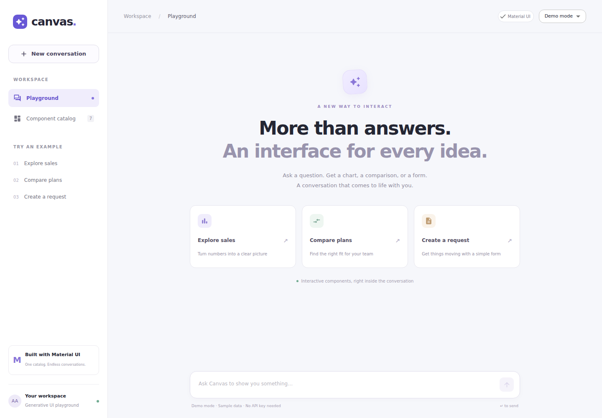
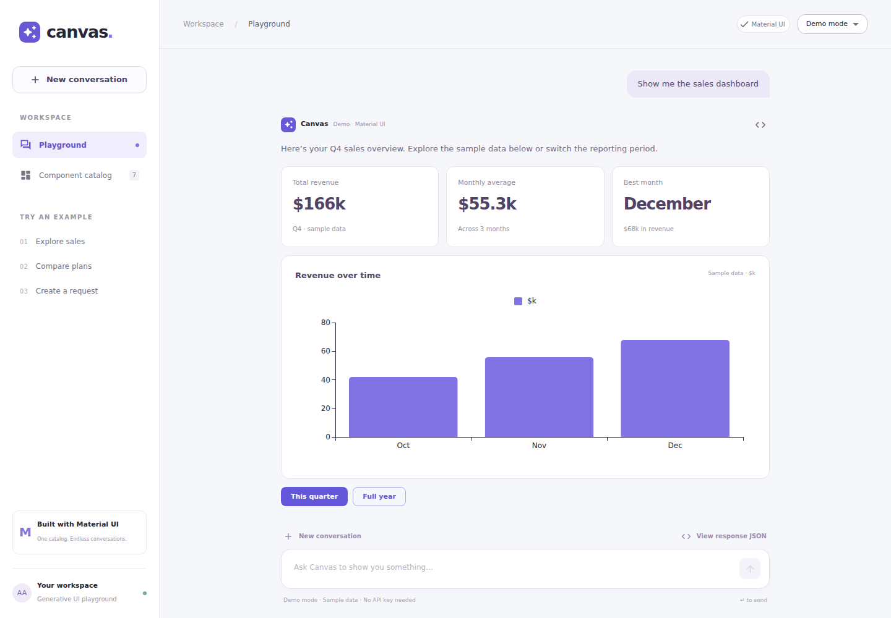
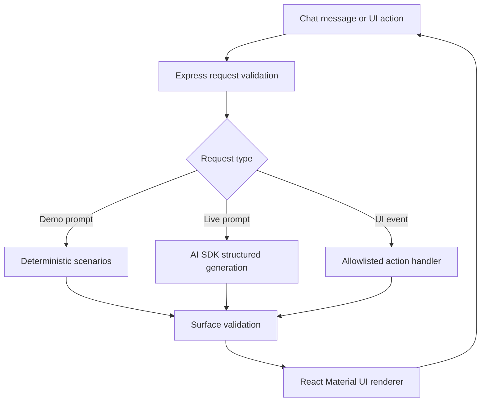

# Canvas — UI in conversation

A React + TypeScript chatbot that renders validated UI descriptions with Material UI and MUI X Charts. Works immediately in deterministic demo mode; optional live generation uses the AI SDK OpenAI provider with your OpenAI API key.





## Run locally

Requires Node.js 22.12+ and npm.

```bash
npm ci
npm run dev
```

Open http://127.0.0.1:5173. Vite forwards `/api` to the Express server at `127.0.0.1:3001`. Both servers stop together with Ctrl+C.

## Try the demo

1. **Explore sales** → revenue cards and bar chart → **Full year** updates the period in a new response. Type “show a line chart” or “show a pie chart” for variants.
2. **Compare plans** → comparison table → **Choose Studio** creates a selection confirmation.
3. **Create a request** → enter a title, category, and priority → submit → review the echoed details.
4. Type **Show project status** for progress bars and status chips.
5. Use **View response JSON** to inspect the validated component description.

All data, prices, selections and submissions are illustrative. No external purchase, request creation, persistence or real data integration occurs. Conversations live in browser memory and reset on reload. Mock mode uses keyword routing; flexible generation and conversational history require Live AI.

## Enable live generation

```bash
cp .env.example .env
```

Set `OPENAI_API_KEY` to your OpenAI API key. That is the only required credential. Restart the server and select **Live AI** in the header. The default model is `gpt-5-mini`; optionally set `OPENAI_MODEL` to another OpenAI model that supports structured outputs. Use the OpenAI model ID directly, without an `openai/` prefix.

```dotenv
OPENAI_API_KEY=your_openai_api_key
# Optional
OPENAI_MODEL=gpt-5-mini
```

Requests go directly to `https://api.openai.com/v1/responses` through `@ai-sdk/openai`. No Vercel account or gateway key is required. Keys stay on the server; never use a `VITE_` prefix for secrets.

The AI SDK uses an explicit OpenAI provider and calls `generateText` with `Output.object({ schema })`. The generated result is validated again for semantic consistency, then validated by the browser before rendering. Invalid responses show a retryable error; live mode never silently falls back to fake data. Button actions remain deterministic in both modes. The last 12 text messages are sent as context; previous component JSON is not resent.

## Architecture



| Path                      | Responsibility                                                              |
| ------------------------- | --------------------------------------------------------------------------- |
| `shared/schema.ts`        | Version 1 component catalog, typed actions, request and response validation |
| `shared/demo.ts`          | Sample facts, deterministic scenarios, action results                       |
| `server/app.ts`           | API routes, live model call, validation, bounded requests                   |
| `src/App.tsx`             | Conversation, request lifecycle, mode selection, JSON inspector             |
| `src/SurfaceRenderer.tsx` | Maps approved component types to Material UI                                |
| `src/Chart.tsx`           | Lazily loaded bar, line and pie charts                                      |
| `tests/`                  | API validation tests and real browser interaction tests                     |

The catalog contains `text`, `metrics`, `chart`, `table`, `actions`, `request_form` and `progress`. Layout and styling are controlled by the frontend. The model supplies typed content, not code. No `eval`, generated JSX, raw HTML rendering, model-selected endpoints, or arbitrary tool execution is used.

This is an **A2UI-inspired custom schema**, not an A2UI wire-protocol implementation. Adobe Spectrum is not installed. To add it, implement a second renderer for the same `UIComponent` types and select the adapter at the application boundary. Protocol-level A2UI support would require a dedicated adapter and compatibility tests.

## Add a component

1. Add a bounded, strict discriminated schema in `shared/schema.ts`.
2. Add the React renderer in `SurfaceRenderer.tsx`; use existing design-system components.
3. Add semantic checks in `parseSurface` where fields depend on each other.
4. Add a demo scenario and update the model instructions/catalog dialog.
5. For an interactive component, add an explicit action schema and server handler. Never turn a model string into executable code or a URL.

## Build and verify

```bash
npm test
npm run build
npx playwright install chromium
npm run test:e2e
```

If Chromium is already installed in a custom location, set `PLAYWRIGHT_CHROMIUM_EXECUTABLE` to its executable path. Browser tests run one worker at a time to keep memory use predictable.

For a local production-build preview:

```bash
npm run build
npm start
```

Open http://127.0.0.1:3001. The server serves `dist/` and `/api` together. `tsx` is required at runtime for this example; do not omit development dependencies for `npm start`.

## Scope and operational notes

- Responses are returned as complete validated JSON, not token-streamed. Loading state is shown during generation.
- Forms are fixed, editable demo forms, not arbitrary agent-defined form schemas.
- Server request bodies, history, text lengths, component counts and chart/table sizes are bounded. Live calls have a 30-second timeout and one retry.
- A simple in-memory per-IP limit allows 10 live prompt requests per minute. This is a local example, not a distributed abuse-control system.
- The server binds to localhost by default. Before public deployment, add authentication, authorization, durable rate limiting, spending limits, HTTPS and a trusted origin policy. Do not expose a paid endpoint merely by changing `HOST`.
- Request IDs are returned for troubleshooting; failure logs omit prompts, provider errors and credentials.
- A real OpenAI generation requires your credentials and is not exercised by the no-key test suite. Tests mock the OpenAI HTTP response to verify the direct endpoint, authorization header, default model and model override; API tests also cover validation/error handling.

## References

- [Material UI](https://mui.com/material-ui/)
- [MUI X Charts](https://mui.com/x/react-charts/)
- [AI SDK structured output](https://ai-sdk.dev/docs/ai-sdk-core/generating-structured-data)
- [A2UI catalog concepts](https://a2ui.org/concepts/catalogs/)
